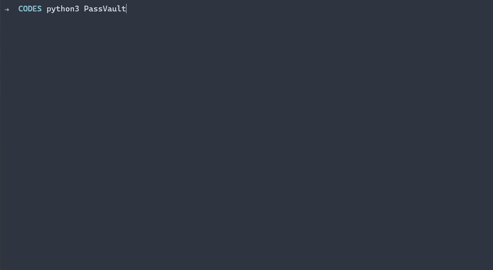

# <a href="https://github.com/vlHan/PassVault"></a>

<p>
   =3.0-blue.svg"> 
   
   
   
</p>

Command-line password manager, for educational purposes, that stores localy, in AES encryption, your sensitives datas in a SQLite database (.db). This project was made to learn more about cryptography and **not for intended for actual use**. This software is used at your own risks. It is provided as is and I (including any contributors) do not take any responsibility for any damage or loss done with or by it.

## Installation
Clone this repository: `git clone https://github.com/vlHan/PassVault.git` or <a href="https://github.com/vlHan/PassVault/archive/refs/heads/main.zip">download zip</a>
- Enter the folder: `cd PassVault/`
- Install python3 
  - Linux
    - `sudo apt-get install python3`
    - `chmod +x *`
    - `python3 -m pip install -r requirements.txt`
    - Finished!

  - Windows and Mac
    - [Python 3, download and install](https://www.python.org/downloads/)
    - `python -m pip install -r requirements.txt`
    - Finished!

## Usage
```bash
# Run the program in the diretory
$ python3 .

# Run the program out of the diretory 
$ python3 PassVault
```

**⚠️** The program needs all the files, be sure to have all the dependecies and files <a href="https://github.com/vlHan/PassVault#installation">installed</a>.

## How It Works
When running, the program will ask to create a master password. This master password will be encrypted and this key will be used to indenty if the user is actually you, be sure you have saved, because the master password is **unrecoverable**.

### Hash Verification
To authenticate the user, they are prompted to create a master password (that is also used to decrypt data) which is then stored using HMAC autentication code (that use SHA3_512 Hash Function as the digest mod). Whenever the user is prompted to verify their master password, the password they enter is compared to the hash of the stored master password and access if granted if the two hashes match.

```py
try:
    cursor = sqlite3.connect('vault.db').cursor()
    cursor.execute("SELECT * FROM masterpassword")
    
    for row in cursor.fetchall():
        stored_master = row[0]
        salt = row[1] 

    print("[cyan][PassVault][/cyan] Enter the master password:", end = ' ')
    self.master_pw = getpass.getpass("").strip() # ask the master password
    
    # compare the two hashes
    if hmac.new(self.master_pw.encode(), msg=str(salt).encode(), digestmod=hashlib.sha3_512).hexdigest() == stored_master:
        # the master password is correct

    else:
        # the master password is not correct

except sqlite3.Error: # if the connection does not work
    # rest of the program
```

### AES Encryption
The encryption method used in this program comes from the python library [PyCryptoDome](https://pypi.org/project/pycryptodome/). This program uses AES encryption methods to store sensitive data (in this case passwords) into a SQLite database.

### SQLite Functions
The SQLite database is used to store sensitive data, as mentioned above. This type of database was used instead of MySQL, as it is easily transported and lightweight. Despite being less secure, it can be easily used and manipulated, so it is possible to keep it in a backup, in case the database is localy lost, you only need the password manager to be able to decrypt the passwords stored in your backup database.

## Demo
<br>

## Built With
* [Python](https://www.python.org) - The language used

## Contributing
Please read [CONTRIBUTING.md](CONTRIBUTING.md) for details on our code of conduct.

## Authors
- **vlHan** - *Initial work* - [vlHan](https://github.com/vlHan)
- **Carvalinho** - *helped me in the AES encryption* - [carvalinh0](https://github.com/carvalinh0)

See also the list of [contributors](https://github.com/vlHan/PassVault/contributors) who participated in this project.

## License 
This project is licensed under the MIT License - see the [LICENSE.md](https://github.com/vlHan/PassVault/blob/master/LICENSE) file for details
